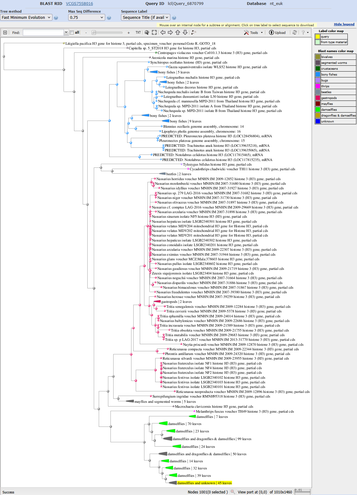
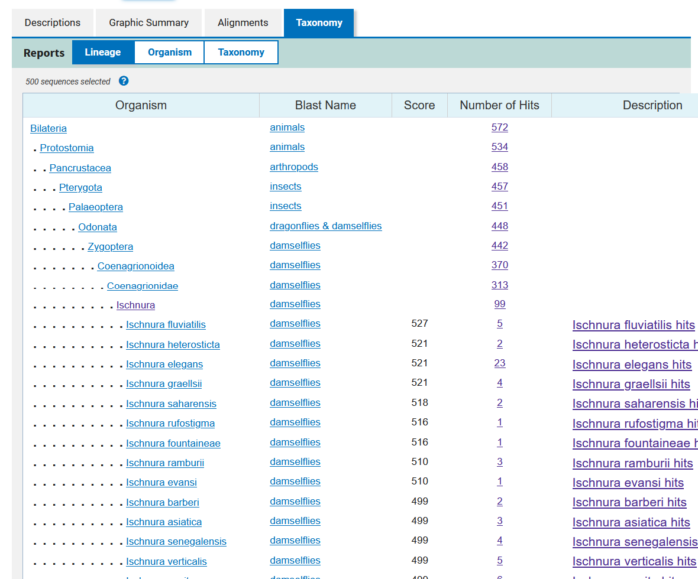
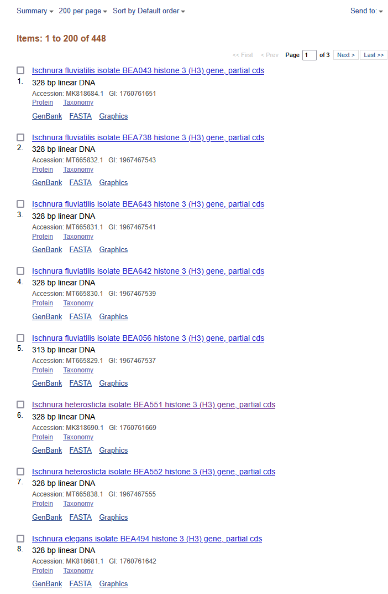

# phylogenetic_tools

These are a collection of R scripts and functions for processing sanger sequences for phylogenetic analysis

---

## Dependencies

MacOS computers need to install [XQuartz](https://www.xquartz.org/)

---

# INSTRUCTIONS

1. [Inspect SANGER chromatograms and edit `*.ab1` files](howto_edit_ab1.md)

2. Make consensus sequences from curated `*.ab1` files with `processCuratedSANGER()` which is a function in `functions_sanger.R` and is applied in `./scripts/EXAMPLE_ischnura_luta_H3_phylogeny_2025-02-19.R`

3. Cull sequences for your phylogeny from GenBank. Use a consensus sequence to query [NCBI Blast](https://blast.ncbi.nlm.nih.gov/Blast.cgi?PROGRAM=blastn&PAGE_TYPE=BlastSearch&LINK_LOC=blasthome) for the most similar sequences
   	* you can vary the number of records returned to increase or decrease the breadth of taxa in your phylogeny
	* on the blast output webpage, select `MSA Viewer` and download the aligned sequences in a fasta
	  
        * on the blast output webpage, select `Distance tree of results` to idendentify the monophyletic clade of ingroups and outgroup for your desired tree
          
          In this tree, the clade with your query seq is highlighted yellow.  If we want all damselflies, then _Melantrhips fuscus_ is the best outgroup and the ingroup is all dragonflies and damselflies (as an example).
        * Explore the `Taxonomy` tab in your blast results page and cross reference against the tree to confirm the monophyletic clade and outgroup for your desired tree.
          
          Based on the tree, we want all damselflies and dragonflies for our ingroups, so we can select `448` next to `dragonflies & damselflies`

	  
	  And now we can show as many records as possible on one page and change the format from `Summary` to `Accession List`.  Note that you will only see the accessions for the first page of results and will have to go back to `Summary`, goto next page, and change format to `Accession List` again (repeat as necessary) to get all of the accession numbers.  Copy them into a text file in you directory, such as `accession_list_damsel-dragonflies.txt`. We will use these to filter the MSA fasta downloaded above. You should also get the accession number for the outgroup and save that to `accession_list_damsel-dragonflies_outgroup.txt`.

	  ~[](markdown_images/blast_taxonomy_damsel-dragonflies.png)

5. Open the MSA fasta downloaded in step 3 and remove sequences that have too many missing base calls. Be sure not to delete critical taxa.

   Add image.

6. Use the [`./scripts/wrangle_blast_output.bash`](./scripts/wrangle_blast_output.bash) script to convert the information in the sequence names to tidy tsv format

   ```bash
   # be sure to navigate to the scripts dir in your repo in linux terminal before running
   cd scripts
   
   # copy the script from phylogenetic tools
   cp ../../phylogenetic_tools/scripts/wrangle_blast_output.bash .
   
   # wrangle_blast_output.bash ReplaceThisTextWithTheBlastMsaFastaFilePath > ReplaceThisTextWithTheNewFilePath.tsv
   bash wrangle_blast_output.bash ../output/sanger_curated_ab1_ischnura_luta_H3/blast_rbd_06_E1_all_619.fasta > ../output/sanger_curated_ab1_ischnura_luta_H3/blast_rbd_06_E1_all_619.tsv
   ```
7. Read the aligned NCBI blast sequences into R using the function `renameBlastFastaSeqs()` from `functions_sanger.R`
   	* See `ischnura_luta_phylogeny.R`

8. Concatenate the consensus and blast fasta files using `concatFastas()` from [phylogenetic_tools](https://github.com/Ph-IRES/phylogenetic_tools)
   	* See `ischnura_luta_phylogeny.R`

9. Deduplicate the sequences using `uniqueSeqsFastaFile()` from [phylogenetic_tools](https://github.com/Ph-IRES/phylogenetic_tools)

10. Align the sequences using `alignFastaFile()` from [phylogenetic_tools](https://github.com/Ph-IRES/phylogenetic_tools)

11. Use `fasta2tree()` from [phylogenetic_tools](https://github.com/Ph-IRES/phylogenetic_tools) to run modelTest, select best evolutionary model, and bootstrap a maximum likelihood phylogeny

12. Use `saveNewickTree()` from [phylogenetic_tools](https://github.com/Ph-IRES/phylogenetic_tools) to output the best maximum likelihood tree to file.

13. Use `figtree` to beautify the tree

