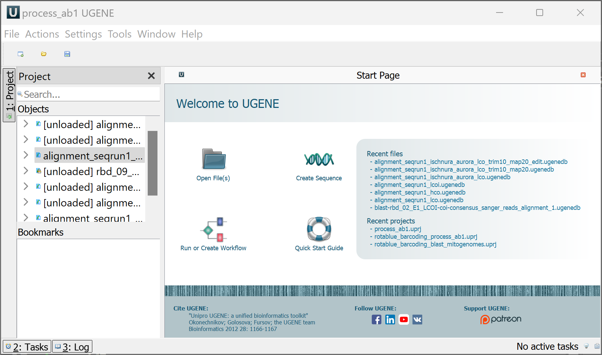
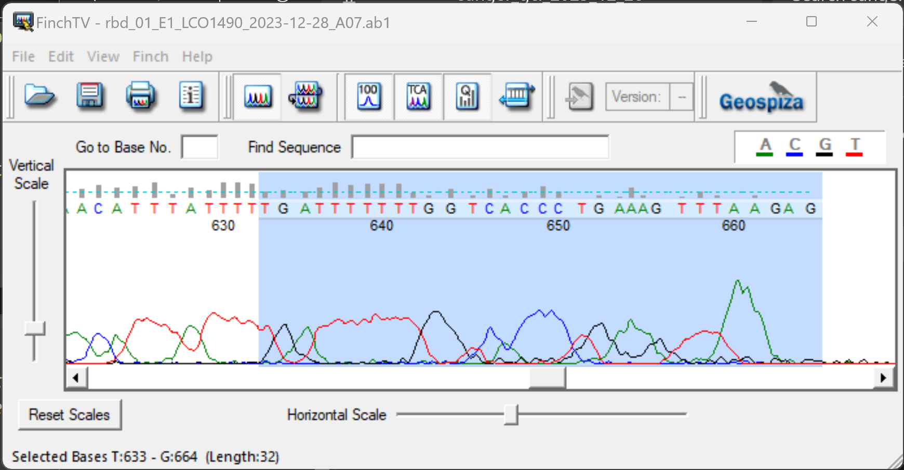
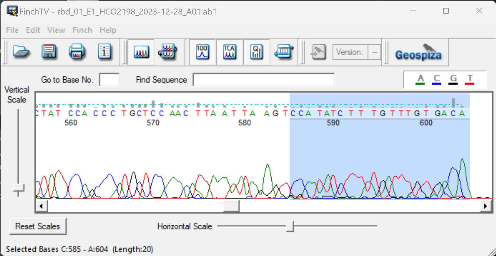
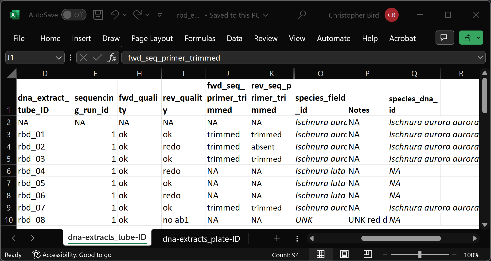
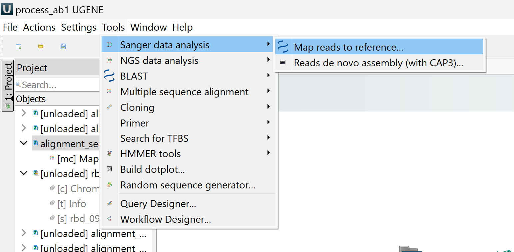
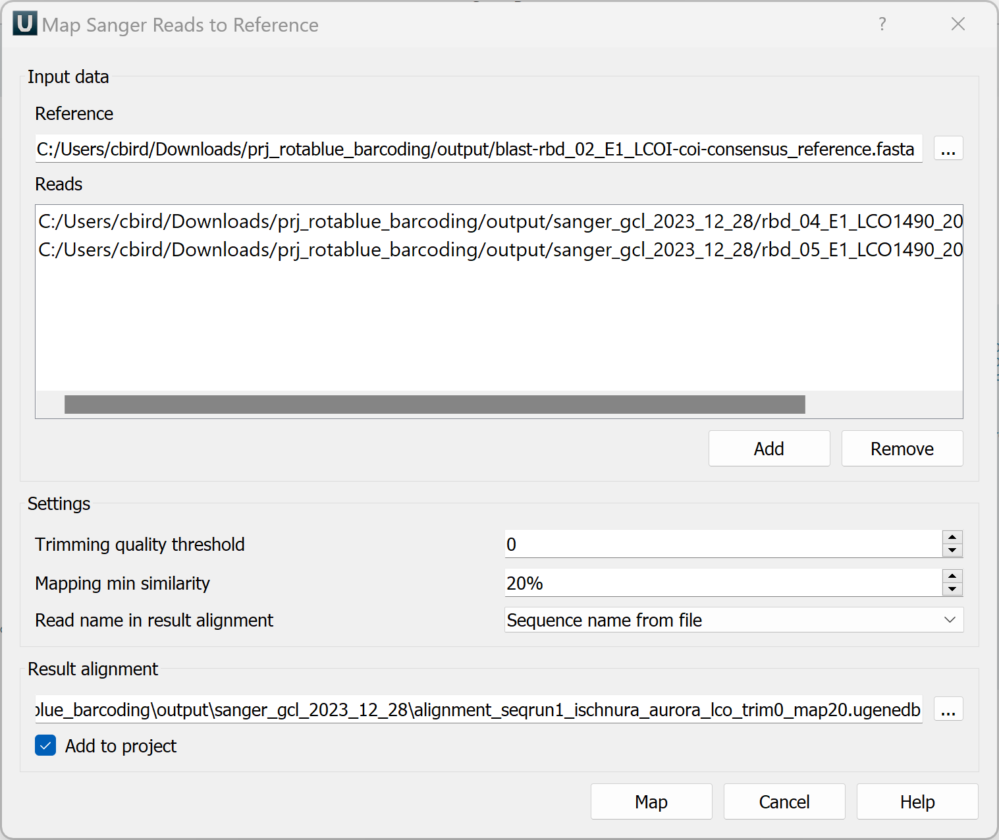
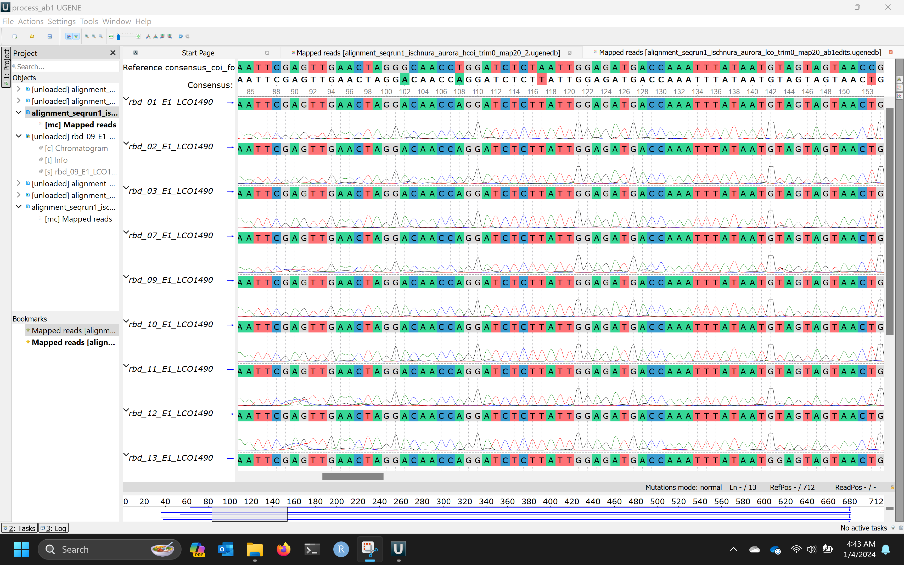
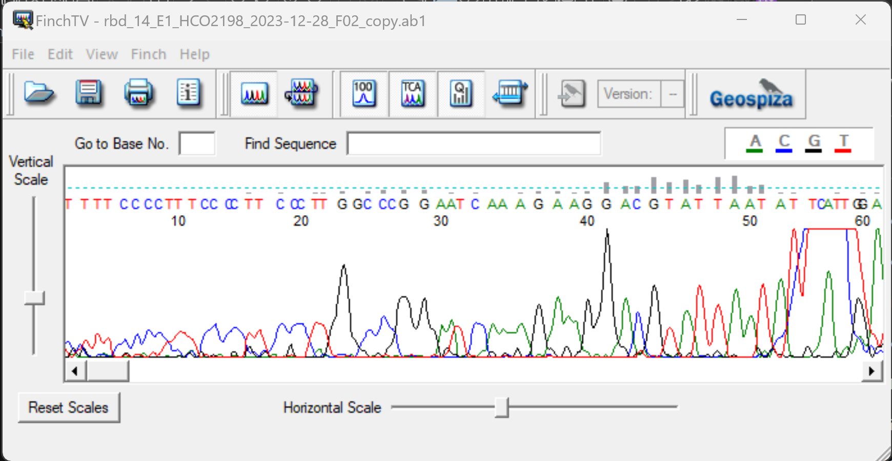
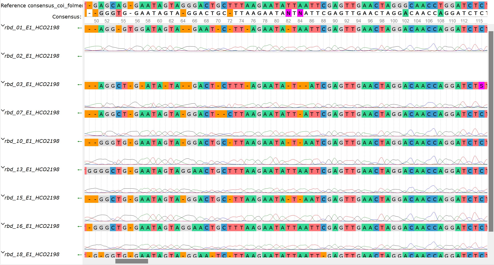

# Inspect chromatograms and edit `*.ab1` files

---

## Software Installation

[Download UGENE](http://ugene.net/download-all.html) and [Installation Instructions](https://doc.ugene.net/wiki/display/UM/Download+and+Installation)

   * Unzip the download, open the dir, double click file named `ugeneui`

[Download FinchTV](https://digitalworldbiology.com/FinchTV) or [Download Chromas](https://technelysium.com.au/wp/chromas/)

   * double click the download, follow instructions

---

## Instructions for Editing/Cleaning the `*.ab1` Files

0. In UGENE open (or create) a project named `prj_rotablue_barcoding/output/process_ab1.uprj`

   

1. Copy the `ab1` files into the `prj_rotablue_barcoding/output/sanger_SEQUENCINGFACILITY_YYYY_MM_DD` dir

2. Remove the HCO1 primer sequence from the 3' end of the LCO1 `*.ab1` files and vice versa.

   

   

   * The ends of the sequence reads will necessarily be the primer sequences, so they can be trimmed off
   * Use [FinchTV](https://digitalworldbiology.com/FinchTV) to trim the `ab1` files
   * Save the trimmed files into `prj_rotablue_barcoding/output/sanger_SeqFacilityName_YYYY_MM_DD`, do not overwrite the original files
   * For your reference, the primer sequences should be saved in `prj_rotablue_barcoding/data/primers.fasta`
      * The sequence at the end of the LCO files is HCO2198: 
	  
         `TGATTTTTTGGTCACCCTGAAGTTTA`
		 
      * The sequence at the end of the HCO files is the reverse compliment of LCO1490: 
	  
         `CCAATATCTTTATGATTTGTTGACC`

   *If the above strategy to trim the primers doesn't work for you, follow the full instructions in [how to trim primers.md](https://github.com/tamucc-gcl/prj_rotablue_barcoding/blob/main/scripts/how_to_trim_primers.md)*
		 
   

3. Trim poor quality sequence from the 5' end of the the HCO1 and LCO1 `*.ab1` files

4. Record the trimming in the `prj_rotablue_barcoding/data/rbd_sequencing_dna_barcodes.tsv` workbook, in the columns named `fwd_seq_primer_trimmed`, `rev_seq_primer_trimmed`, `fwd_seq_5_trimmed`, and `rev_seq_5_trimmed`

      

      * If the primer seq was present and trimmed, `trimmed`
      * If the primer seq was not present, `absent`
      * Otherwise, `NA`
   * As you go, note which sequence reads need to be redone (either resequenced or repcred) in the `prj_rotablue_barcoding/data/rbd_extraction_barcoding.tsv` workbook, in the columns named `fwd_quality` and `rev_quality`

5. Map all LCO1490 from a single taxon to the consensus reference sequence in UGENE
   
   
   
   
   

   * The more similar the sequences are, it seems the better this will work
      
   * `Tools/Sanger Data Analysis/Map Reads to Reference`
      * `Reference: prj_rotablue_barcoding/output/blast-rbd_02_E1_LCO-coi-consensus.fasta`
         * [Instructions to create the reference sequence](howto_create_reference.md) if it does not exist
	  * Add all LCO1490 `ab1` files to `Reads` 
      * `Trimming quality threshold: 0`
         * Lowering this value will retain more base calls from the chromatograms, especially at the beginning.
      * `Mapping min similarity: 20%`
         * Lowering this value reduces the number of gaps in the alignment
      * Update `Result alignment` to be in the `ouput` dir: `alignment_seqrun1_TAXON_lco1_trim10_map20.ugenedb`
   

   * Click `Map` button
   
   Now you have created a new file that is disconnected from the `ab1` files.  Changes made in UGENE will not affect the `ab1` files.
   
   

   
6. Use the alignment of the chromatograms in UGENE to guide further editing of the `ab1` files with FinchTV.

   * Because UGENE does not edit the `ab1` files, we will use FinchTV to edit them.
   
      
   
   * The same edits you make in UGENE to fix the base call errors, you should also make using FinchTV
      * This is somewhat tedious, but it is ultimately worth it. As we clean the `ab1` files, we will go back and redo step 2.  When the `ab1` files are fully cleaned and edited, there will be no need to edit in UGENE.
   
   * There are no indels in COI, so we know that all indels in the alignment are errors.
      * Your goal is to edit the EGENE alignment so that the indels in the `Reference seq` occur in every other sequence.  Edit the `ab1` in FinchTV as you go.  Then you can `right click/Edit/Remove all columns of gaps` (sort of like Tetris, but sideways)
      * You will encounter the most indels at the beginning of the sequence reads, but I'd start at indels in the middle, and work your way to the beginning and end.
   
   * Scan along the `Consensus` sequence at the top and visually inspect and nucleotides highlighted in fuscia.
      * The fuscia color indicates that at least one of your sequences has a different nucleotide than the rest. This can certainly be the case, but you need to confirm the alternate nucleotide call on the chromatogram.
   
   * You also need to scan the chromatograms for double peaks and use the [IUPAC Ambiguity Codes](https://droog.gs.washington.edu/parc/images/iupac.html) to edit the base call.
      * Reading a chromatogram takes a bit of experience, but if the peaks are very clean, then if a second peak is more than 50% of the height of the primary peak, then use the IUPAC Ambiguity Code.
      * Given that there's generally only 1 mitochondrial sequence per indiviudal, double peaks are rare, but do occur from time to time. If there are a lot of double peaks, it is noteworthy.
   
   * In UGENE, do not delete the first nucleotide at the beginning of the sequence. If it is erroneous, replace it with an `X`. If you ignore this, the chromatogram will be hopelessly out of phase with the sequence and you'll have to map again.
   
   * Note that edits occuring in UGENE, including the indels introduced by mapping distort the chromatogram signals.  Look at the `ab1` files using FinchTV for an accurate rendering of the chromatogram.
      * As you fix the errors in UGENE, the chromatograms will reasonably approximate they way they actually look.
   
   * Example of chromatograms that are too poor to be edited completely from beginning to end.  These need to be resequenced.

      

      * If your final alignment looks like that above, then In FinchTV, the left side of these `ab1` files should be deleted up to the last indel in the UGENE mapped alignment.
   
7. When you've completed step 4, goto step 3 and map your edited `ab1` files.

   * Continue with step 4 (and 3) until no edits are required to fix the mapped reads.

8. Repeat steps 3-5 for the reverse sequence read (HCO)

   * It will be worth while to reverse and compliment the `ab1` files in FinchTV: `View/Reverse Complement`
   
9. Inspect the alignment of the fwd and reverse reads and edit the `ab1` files in FinchTV as necessary

   * Once you've completed step 6, map all of the edited `ab1` files, both fwd and reverse
   * Arrange them so you can compare the two reads for each specimen
   * Sequence reads from the same specimen should have the same sequence

10. The `ab1` files have now been cleaned and are ready for automated processing
